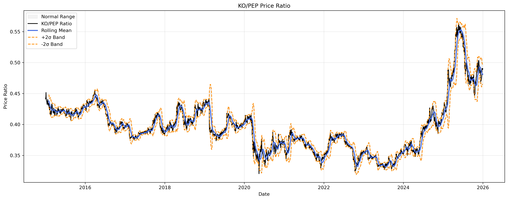
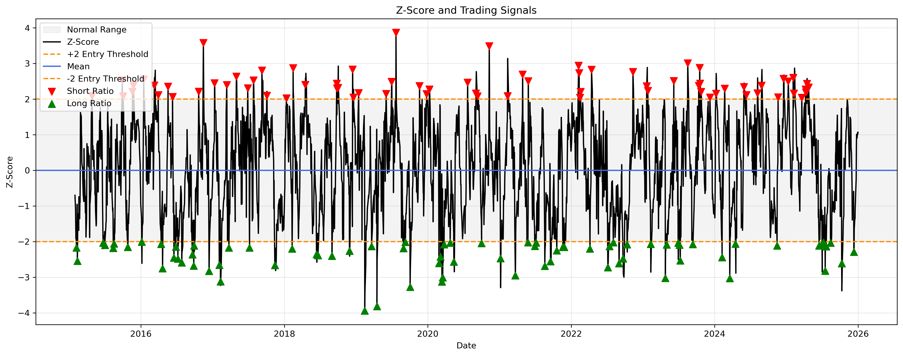
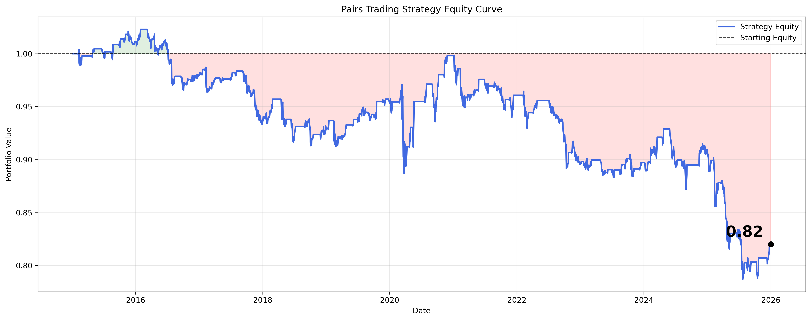

# Pairs Trading Strategy

A statistical arbitrage (pairs trading) strategy implemented in Python using Coca-Cola (KO) and Pepsi (PEP) historical stock data.

The project demonstrates the complete workflow of a quantitative trading strategy, from data collection and feature engineering through to backtesting and performance evaluation.

---

## Features

- Historical market data collection using yfinance
- Price ratio calculation
- Rolling mean and rolling standard deviation
- Z-score based trading signals
- Position generation
- Transaction cost modelling
- Strategy backtesting
- Performance metrics
- Trade statistics
- Data visualisation

---

## Example Outputs

### Price Ratio

### Z-Score and Trading Signals

### Equity Curve

---

## Technologies

- Python
- pandas
- NumPy
- matplotlib
- yfinance

---

## Strategy Overview

The strategy assumes that the historical relationship between Coca-Cola (KO) and Pepsi (PEP) will exhibit mean reversion.

When the price ratio deviates sufficiently from its rolling average (measured using a z-score), positions are opened. Positions are closed once the ratio returns towards its historical mean.

---

## Results

The strategy was successfully implemented and evaluated over the selected backtest period.

Key observations:

- 96 completed trades
- 60.42% win rate
- Profit Factor: 0.68
- Total Return: -17.99%

Although the strategy generated profitable trades frequently, the average losing trade was substantially larger than the average winning trade, resulting in negative overall performance.

---

## Future Improvements

- Cointegration testing
- Parameter optimisation
- Train/test validation
- Walk-forward analysis
- Dynamic position sizing
- Risk management techniques

---

## Author

Toby Newman
